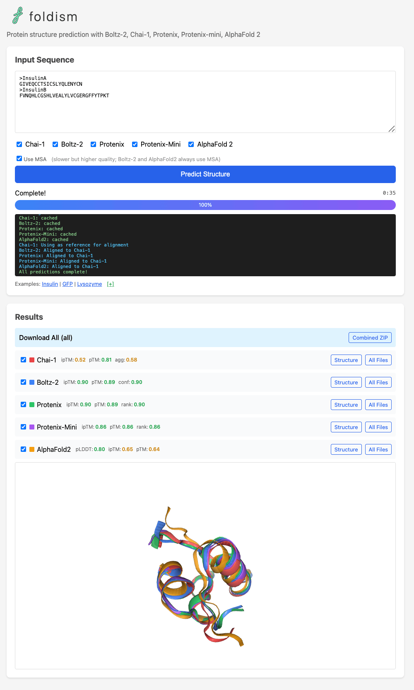

# Foldism

Multi-algorithm protein structure prediction using Modal serverless infrastructure.

Runs **Boltz-2**, **Chai-1**, **Protenix**, **Protenix-Mini**, **AlphaFold2**.



## Quick Start

Set up uv and modal (mac and linux)
```bash
curl -LsSf https://astral.sh/uv/install.sh | sh
uvx modal setup
```

Run dev server or deploy to Modal
```bash
uvx modal serve foldism.py
uvx modal deploy foldism.py
```

## Command Line Interface

Run basic tests on command line
```bash
echo -e ">Insulin\nGIVEQCCTSICSLYQLENYCN\n>InsulinB\nFVNQHLCGSHLVEALYLVCGERGFFYTPKT" > input.faa
uvx modal run foldism.py --input-faa input.faa
uvx modal run foldism.py --input-faa input.faa --algorithms chai1,boltz2
uvx modal run foldism.py --input-faa input.faa --no-use-msa  # skip MSA (faster)
```

## Cost
- Modal currently gives you $30 per month free to experiment with
- A run with all 5 methods can cost **$1 or more** depending on sequence length (GPUs cost $1-4 per hour)
- Results are cached, so re-running the same sequence is almost free
- If you `modal deploy`, the URL is publicly available (anyone who finds it can use it)
- If you want to require users to authenticate, set up a [custom domain](https://modal.com/docs/guide/webhook-urls).
  I use cloudflare but there are many ways to do this.

## License

MIT
